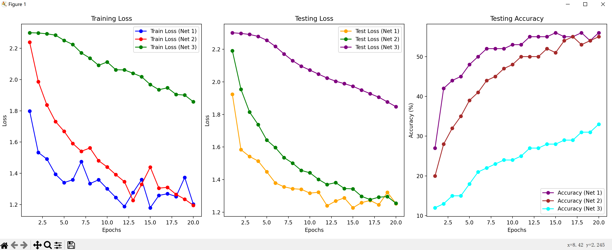
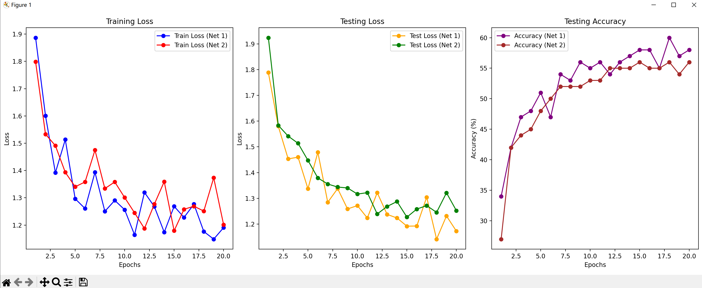
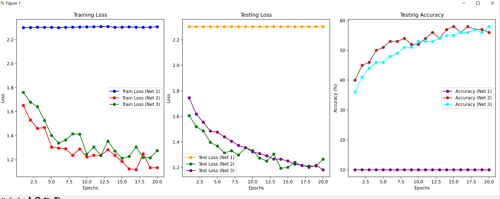
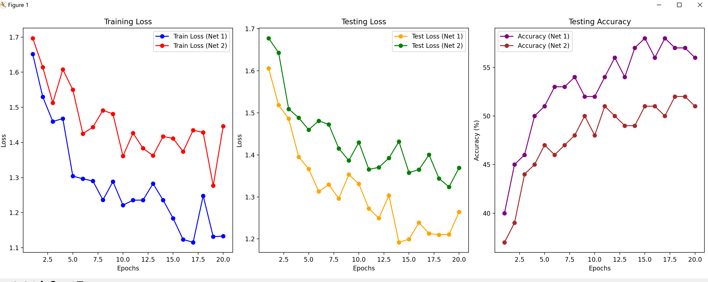
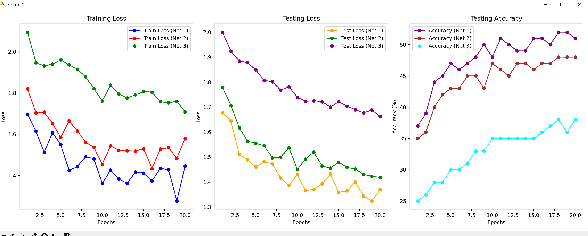
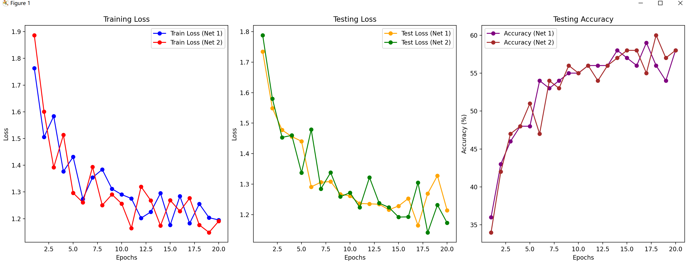
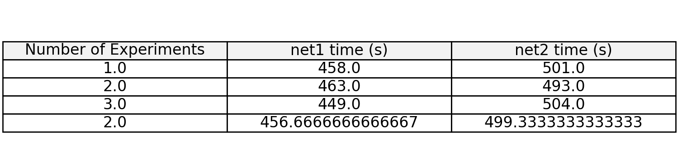

# __实验环境__

    python = 3.8.8
    torch = 1.8.0
    torchvision = 0.9.0
所需依赖包：torch torchvision torch.nn torch.optim torch.nn.functional torch.optim 
如果您的电脑没有安装这些依赖包，可以通过以下命令安装：

```bash
pip install torch torchvision 
```
# __数据集下载__

数据集：CIFAR10
下载链接：[CIFAR10数据集下载](https://www.cs.toronto.edu/~kriz/cifar-10-python.tar.gz)
或者您可以直接运行代码，将自动将数据集下载到相应目录中

# __运行方式__

首先将 _SGD优化方法.py_ ， _Adam优化方法.py_ ， _基于Adam的SAM优化方法.py_ ， _基于SGD的SAM优化方法.py_ ， _对SAM的ESAM优化.py_ ， _Esam.py_ ， _sam.py_ 这几个个代码放在同一个目录下；然后在该目录下运行以下命令来分别运行这几个代码：
```bash
python SGD优化方法.py
python Adam优化方法.py
python 基于Adam的SAM优化方法
python 基于SGD的SAM优化方法
...
```

# __实验结果__

首先不同的学习率对SGD优化方法的影响：

发现Lr取0.1是最合适的。取lr=0.1，进一步探讨了SGD优化方法和基于SGD的SAM优化方法的差异：


不同的学习率对Adam优化方法的影响：

发现Lr取0.01是最合适的。取lr=0.01，进一步探讨了Adam优化方法和基于Adam的SAM优化方法的差异：


探讨不同的rho值对基于Adam的SAM优化方法的影响：


使用ESAM方法对原本的SAM方法进行改进，并与原本的基于SGD的SAM优化方法进行对比：

    二者性能大致相同，但运行时间有差异：


对实验结果的详细分析见实验报告。
所有源代码及该readme文档都已上传github，地址：[https://github.com/kinoaaaaaa/homework](https://github.com/kinoaaaaaa/homework)
